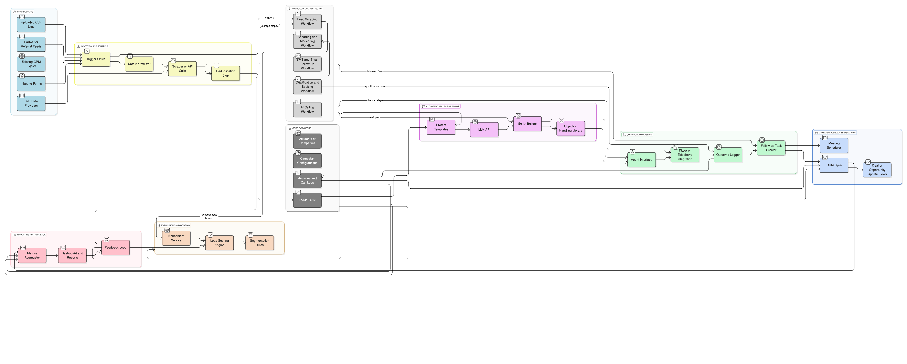
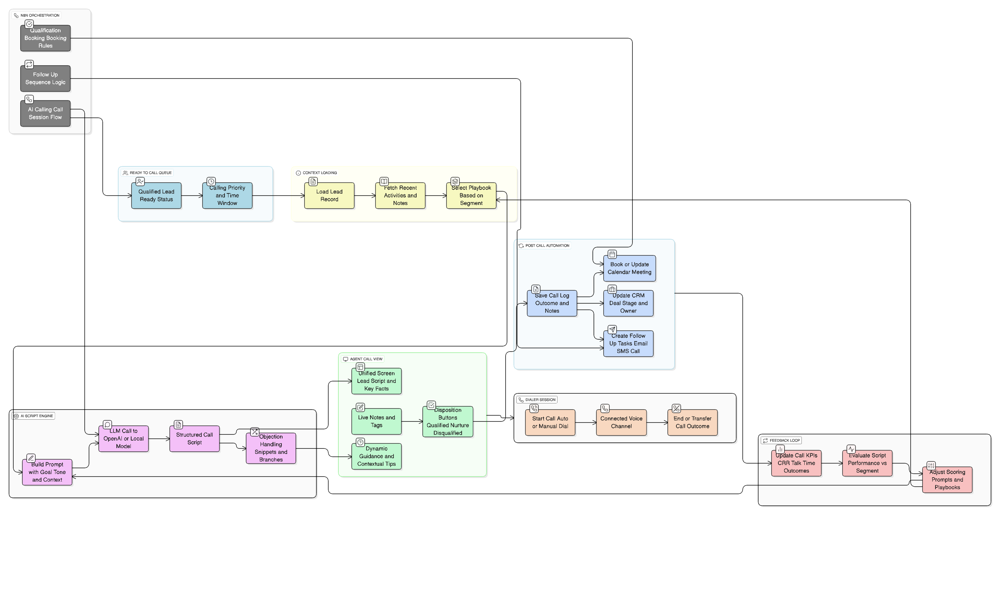

# Lead Scraping & AI Cold Caller Appointment Setter (Showcase)

**Production-ready n8n workflows for automated lead generation, AI outbound calling, qualification, and multi-channel follow-ups.**

> 🚀 **Deployment Status**: Production-ready with complete n8n expert audit (v1.2.0 - 2025-11-30)

This repository is a **public, sanitized showcase** of a private project that orchestrates a complete end-to-end sales automation system:

- **Automated lead scraping** (500+ leads/day)
- **AI-powered cold calling** with natural voice conversations
- **Smart qualification** and lead scoring
- **Automated meeting booking** via calendar integration
- **Multi-channel follow-ups** (SMS + Email)
- **Daily reporting** and system health monitoring

> ⚠️ **Note:** This repo contains **no real lead data, no API keys, and no production configuration**.  
> It exists purely as a *portfolio-style* overview of the architecture, workflows, and patterns used in the private implementation.

---

## 🎯 What This System Does

A complete, end-to-end sales automation system running entirely in **n8n**:

1. **Scrapes high-quality leads daily** (Apollo.io via Apify)
2. **Makes AI-powered cold calls** (Bland.ai voice AI)
3. **Analyzes call outcomes** and qualifies leads automatically
4. **Books meetings** with qualified leads (Cal.com integration)
5. **Sends smart follow-ups** (SMS + Email) based on call outcome
6. **Reports daily metrics** and monitors system health
7. **Alerts immediately** when something breaks

**No code required.** Everything is configured through n8n's visual interface.

---

## ✨ Key Features

### Lead Scraping
- ✅ Daily automated scraping (500+ leads/day)
- ✅ Industry and location filtering
- ✅ Automatic deduplication
- ✅ Phone number normalization
- ✅ Data validation and cleaning

### AI Calling System
- ✅ Natural voice conversations (Bland.ai)
- ✅ Customizable scripts per industry
- ✅ Call recording and transcription
- ✅ Intent analysis from transcripts
- ✅ Automatic outcome classification
- ✅ Rate limiting (5s between calls)

### Smart Qualification
- ✅ Multi-factor scoring algorithm
- ✅ Budget, authority, need, timeline (BANT) detection
- ✅ Automatic qualification routing
- ✅ Scores 0-100 based on call quality

### Meeting Booking
- ✅ Auto-generates personalized booking links
- ✅ Cal.com integration
- ✅ Instant SMS + Email with link
- ✅ Meeting confirmations
- ✅ 24-hour reminders

### Follow-up Automation
- ✅ Conditional sequences based on call outcome
- ✅ Multi-channel (SMS + Email)
- ✅ Auto-stops when lead replies
- ✅ 5 different follow-up tracks:
  - Interested → Immediate booking
  - Maybe → 2-day follow-up
  - Voicemail → 1-day follow-up
  - No Answer → 4-day follow-up
  - Not Qualified → 30-day nurture

### Reporting & Monitoring
- ✅ Daily summary reports (6 PM)
- ✅ Lead metrics (scraped, qualified, meetings)
- ✅ Call metrics (total, outcomes, avg length)
- ✅ Conversion rates
- ✅ Health checks every 5 minutes
- ✅ Instant alerts for critical issues
- ✅ Auto-fixes stuck calls

---

## 🏗️ Tech Stack

| Component | Technology | Why |
|-----------|-----------|-----|
| **Workflow Engine** | n8n | Visual automation, self-hosted, unlimited workflows |
| **Database** | PostgreSQL | Reliable, powerful querying, built-in n8n support |
| **Lead Scraping** | Apify (Leads Finder) | High-quality B2B data, validated emails |
| **AI Voice** | Bland.ai | Most natural AI voice, great for cold calling |
| **SMS** | Twilio | Industry standard, reliable delivery |
| **Email** | SendGrid | High deliverability, great API |
| **Booking** | Cal.com | Open-source, flexible, embeddable |

---

## 🏛️ System Architecture

The system consists of **5 interconnected n8n workflows**:

```
┌─────────────────────┐
│  Lead Scraping      │
│  (Daily at 6 AM)    │
└──────────┬──────────┘
           │
           ▼
┌─────────────────────┐
│  Deduplication &    │
│  Normalization      │
└──────────┬──────────┘
           │
           ▼
┌─────────────────────┐
│  PostgreSQL         │
│  (Lead Storage)     │
└──────────┬──────────┘
           │
           ▼
┌─────────────────────┐
│  AI Calling         │
│  (Bland.ai)         │
└──────────┬──────────┘
           │
           ▼
┌─────────────────────┐
│  Call Analysis      │
│  (Transcript + AI)  │
└──────────┬──────────┘
           │
           ├─────────────────────┐
           │                     │
           ▼                     ▼
┌──────────────────┐   ┌──────────────────┐
│  Qualification   │   │  Follow-up       │
│  Scoring         │   │  Sequences       │
└────────┬─────────┘   └──────────────────┘
         │
         ▼
┌──────────────────┐
│  Meeting         │
│  Booking         │
└──────────────────┘
         │
         ▼
┌──────────────────┐
│  Reporting &     │
│  Monitoring      │
└──────────────────┘
```

### The 5 Workflows

1. **Lead Scraping Workflow** - Daily automated scraping, deduplication, and normalization
2. **AI Calling Workflow** - Bland.ai integration, call execution, and transcript analysis
3. **Qualification & Booking Workflow** - Lead scoring, BANT detection, Cal.com integration
4. **SMS/Email Follow-up Workflow** - Multi-channel conditional sequences
5. **Reporting & Monitoring Workflow** - Daily reports, health checks, and alerts

---

## 📊 Performance & Metrics

### Expected Results (100 calls/day)

- **Lead-to-Call Rate**: 100% (all scraped leads get called)
- **Call Answer Rate**: 30-40% (industry standard)
- **Interest Rate**: 15-25% of answered calls
- **Qualification Rate**: 5-10% of all calls
- **Meeting Booking Rate**: 60-80% of qualified leads
- **Overall Conversion**: 3-5% (scrape → meeting)

### Speed

- **Scraping**: 500 leads in ~10-15 minutes
- **Calling**: 100 calls in ~3 hours (sequential, 5s delay)
- **Follow-ups**: Instant (<1 second per lead)
- **Reporting**: ~30 seconds to generate

### Estimated Costs (100 calls/day)

| Service | Monthly Cost |
|---------|-------------|
| Bland.ai | $540-810 |
| Twilio SMS | $22.50 |
| SendGrid | $15 |
| Apify | $49 |
| Cal.com | Free (self-hosted) |
| PostgreSQL | $25 or Free |
| **Total** | **~$650-920/month** |

**ROI**: If you close 1 deal per month, this pays for itself.

---

## 🔒 Production Improvements

### Recent Fixes (v1.2.0 - 2025-11-30)

**Complete n8n expert audit identified and fixed 15 critical issues:**

#### Critical Fixes (5)
- ✅ **SQL Injection Vulnerability** - Parameterized all database queries
- ✅ **Broken Boolean Logic** - Fixed qualification workflow SQL statements
- ✅ **Missing Webhook Responses** - Added response nodes to prevent hanging
- ✅ **Invalid Cal.com API** - Replaced with manual link generation
- ✅ **Concurrent Calling Bug** - Sequential processing with proper rate limiting

#### Major Fixes (5)
- ✅ **Missing Database Column** - Added `last_error` column for error logging
- ✅ **Deployment Script** - Fixed path detection for any directory
- ✅ **Webhook Handlers** - Fixed missing endpoints (404 errors)
- ✅ **PostgreSQL Version** - Updated node version for compatibility
- ✅ **JSON Syntax** - Fixed environment variable expressions

#### Performance Improvements (5)
- ✅ **Rate Limit Optimization** - Moved to after call execution
- ✅ **Race Condition** - Added Wait node between INSERT and SELECT
- ✅ **Environment Validation** - Complete `.env.example` documentation
- ✅ **Error Handling** - Proper responses on all execution paths
- ✅ **Documentation** - Comprehensive migration and testing guides

**See [docs/critical-fixes-v1.2.0.md](docs/critical-fixes-v1.2.0.md) for complete details.**

### Security & Reliability

- 🔐 Parameterized database queries
- 🔄 Automatic retry on transient failures
- ✅ Input validation on all webhooks
- 📊 Health monitoring every 5 minutes
- 🚨 Instant alerts for critical issues
- 🛡️ Rate limiting to prevent API abuse

---

## 🏗️ Architecture Visuals

These diagrams are the **canonical high-level views** for the project.

| Lead Pipeline | AI Caller Flow |
|---------------|----------------|
|  |  |

- **Lead Pipeline** (`diagram-export-11-28-2025-4_32_18-AMREV.png`)  
  End-to-end view: sources → ingestion & scraping → enrichment & scoring → LLM script engine → outreach → CRM / calendar → analytics & feedback.

- **AI Caller Flow** (`diagram-export-11-28-2025-5_07_28-AMREV.png`)  
  Zoom-in on a single call session: ready-to-call queue → context loading → AI script engine → agent view → dialer → post-call automation → feedback loop.

Additional diagrams (planned):

- `diagrams/data-model-overview-v1.png` – contacts, accounts, activities, call logs, and appointments
- `diagrams/system-context-v1.png` – scraping, enrichment, LLM service, dialer, CRM, and analytics

---

## 📁 Repository Scope

This showcase repo includes:

- High-level documentation in `docs/`
- Public-friendly architecture diagrams in `diagrams/`
- Mermaid sources for diagrams (e.g. `lead-pipeline-topology-v1.mmd`, `ai-caller-flow-v1.mmd`)
- **Technical architecture overview** showing the 5-workflow n8n system
- **Production deployment insights** (sanitized, no credentials)

It **does not** include:

- Real lead lists, exports, or scraped datasets
- API keys, tokens, or provider credentials
- Customer-specific playbooks or internal business logic
- Actual n8n workflow JSON files (these remain private)
- Database schemas with production data

The full production implementation lives in a **separate private repository**.

---

## 📚 Documentation

Core docs live in the `docs/` directory:

- [`docs/overview.md`](docs/overview.md) - Detailed system architecture and workflow descriptions
- [`docs/deployment-summary.md`](docs/deployment-summary.md) - Deployment patterns and best practices
- [`docs/critical-fixes-v1.2.0.md`](docs/critical-fixes-v1.2.0.md) - **NEW** Complete n8n expert audit results
- [`docs/workflows.md`](docs/workflows.md) - *(Coming soon)* Deep dive into each of the 5 workflows
- [`docs/compliance.md`](docs/compliance.md) - *(Coming soon)* TCPA, GDPR, and CAN-SPAM guidelines

### Key Concepts

- **5-Workflow Architecture**: Modular design with clear separation of concerns
- **Event-Driven**: Workflows communicate via webhooks and database triggers
- **Production-Ready**: Includes retry logic, validation, monitoring, and alerts
- **Scalable**: Can handle 100-1000+ calls/day with proper infrastructure

---

## 🔒 Related (Private Implementation)

The actual implementation (code, workflows, configs) lives in a private repo:

- `gravitasse/Lead_Scraping_AI_Cold_Caller_Appointment_Setting_Project` (private)

This showcase is safe to share publicly (LinkedIn, portfolio, proposals) while preserving:

- Data privacy
- Provider terms of service
- Internal IP and detailed implementation choices
